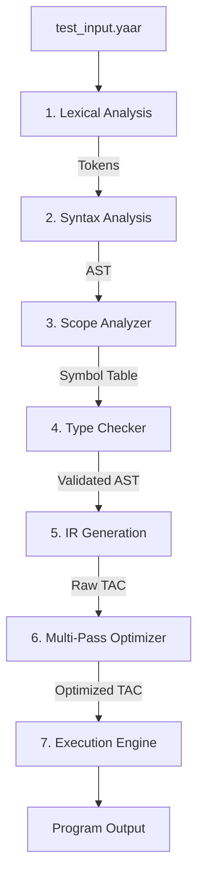

# 🚀 YaarScript: an Urdu-Slang Multi-phase Compiler

[](https://yaarscript.netlify.app/)

> A sophisticated multi-phase compiler written in Rust, designed to demonstrate advanced compiler construction techniques through semantic analysis, intermediate representation optimization, and code execution—now with a uniquely fun Urdu-slang flavored syntax.

## 📋 Table of Contents

- [Project Overview](#project-overview)
- [Architecture & Compilation Pipeline](#architecture--compilation-pipeline)
- [Urdu Slang Keywords & Traditional Equivalents](#urdu-slang-keywords--traditional-equivalents)
- [Operator Precedence Table](#operator-precedence-table)
- [Valid and Invalid Code Examples](#valid-and-invalid-code-examples)
- [Building & Running](#building--running)

---

## 🏗️ Architecture & Compilation Pipeline

YaarScript follows an industrial-grade multi-phase compilation architecture, lowered into an optimized linear Intermediate Representation (IR) before execution.



### 1. Lexical Analysis (Lexer)
The Lexer converts raw source text into a prioritized stream of Tokens, mapping Urdu slang to compiler primitives.

> [!NOTE]
> Deep dive into the greedy Maximal-Munch algorithm and slang normalization in the [Lexer Architecture Guide](./docs/LEXER.md).

### 2. Syntax Analysis (Parser)
The Parser builds the Abstract Syntax Tree (AST) using a Hybrid Parsing Model (Recursive Descent + Pratt Parsing).

> [!NOTE]
> Read about the Nud/Led dispatch logic and EBNF grammar in the [Parser Architecture Guide](./docs/PARSER.md).

### 3. Semantic Analysis (Scope Analyzer)
The Scope Analyzer enforces lexical scoping rules, identifies symbol overlapping, and constructs a hierarchical Symbol Table.

> [!NOTE]
> Explore the Two-Pass Symbol Collection and LIFO scope stack in the [Scope Analyzer Guide](./docs/SCOPE_ANALYZER.md).

### 4. Semantic Analysis (Type Checker)
The Type Checker enforces a strict Zero-Coercion Policy, validating binary compatibility across the AST.

> [!NOTE]
> Learn about bottom-up type inference and strict casting validation in the [Type Checker Guide](./docs/TYPE_ANALYZER.md).

### 5. IR Generation (TAC Generator)
The TAC Generator lowers the validated AST into Standard Quadruple Form Three-Address Code (TAC).

> [!NOTE]
> View how intrinsic functions are safeguarded and control flow is lowered in the [TAC Generation Guide](./docs/TAC_GENERATION.md).

### 6. IR Optimization
A Fixed-Point Convergence Model applies Constant Folding, Propagation, and Dead Code Elimination.

> [!NOTE]
> Analyze the cascade effects of the Mark-and-Sweep optimizations in the [IR Optimizer Guide](./docs/IR_OPTIMIZATION.md).

---

## 🌍 Urdu Slang Keywords & Traditional Equivalents

YaarScript Maps localized terminology directly to robust systems logic.

| YaarScript Keyword | C-Equivalent | Purpose |
|--------------------|--------------|---------|
| `number` | `int64_t` | 64-bit signed integer |
| `float` | `double` | 64-bit floating point |
| `faisla` | `bool` | Boolean value |
| `lafz` | `char*` | String primitive |
| `khaali` | `void` | No return value |
| `pakka` | `const` | Immutable constant |
| `yaar` | `main` | Entry point block |
| `agar` | `if` | Conditional branch |
| `warna` | `else` | Alternative branch |
| `jabtak` | `while` | Loop continuation |
| `dohrao` | `for` | Iterative loop |
| `intekhab` | `switch` | Multi-way branching |
| `bas_kar` | `break` | Scope exit |
| `wapsi` | `return` | Function return |
| `qism` | `enum` | Enumeration type |
| `bolo` | `printf` | Console Output |
| `suno` | `scanf` | Console Input |
| `sahi` | `true` | Boolean true |
| `galat` | `false` | Boolean false |

---

## 📊 Operator Precedence Table

The parser natively incorporates the **Power Operator** with high precedence.

| Level | Operators | Associativity | Example |
|-------|-----------|---------------|---------|
| 1 | `=` | Right-to-left | `a = b = c` |
| 2 | `\|\|` | Left-to-right | `a \|\| b` |
| 3 | `&&` | Left-to-right | `a && b` |
| 4 | `==`, `!=` | Left-to-right | `a == b` |
| 5 | `<`, `>`, `<=`, `>=` | Left-to-right | `a < b` |
| 6 | `&`, `\|`, `^`, `<<`, `>>` | Left-to-right | `a & b` |
| 7 | `+`, `-` | Left-to-right | `a + b` |
| 8 | `*`, `/`, `%` | Left-to-right | `a * b` |
| 9 | **`**` (Power)** | **Left-to-right** | `a ** b` |
| 10 | `-`, `!`, `++`, `--` (prefix) | Right-to-left | `!-x` |
| 11 | `++`, `--` (postfix) | Left-to-right | `x++` |
| 12 | `()` | Highest | `f(x)` |

---

## 💻 Valid and Invalid Code Examples

### ✅ Correct Code Snippet (from `tests/type/valid.yaar`)

```rust
yaar {
    number w = 10;
    number h = 20;

    dohrao (number i = 0; i < 5; i++) {
        agar (i == 3) {
            bas_kar; 
        }
    }

    faisla flag = (w > 5) && (h < 50);
    faisla check = !flag;
    
    number result = w ** 2; // Power operator test
    bolo("Computed successfully! ", result);
}
```

**Expected Output:**
```text
0
1
2
Computed successfully! 100
```

### ❌ Incorrect Code Snippet (from `tests/type/error.yaar`)

Shows strict type safety catching errors before execution.

```rust
khaali invalidVar; // ERROR: 1. ErroneousVarDecl

khaali voidFunc() {
    bolo("hello");
}

yaar {
    number i = 10;
    float f = 3.14;
    
    // 3. FnCallParamType
    voidFunc(f); 
    
    // 5. ExpressionTypeMismatch
    i = 3.14; 
    
    // 7. NonBooleanCondStmt
    agar (i) { 
        bolo("wont work");
    }
}
```

**Compiler Output (Caught at Semantic Stage):**
```text
[Type Error] Variable invalidVar cannot be of type void
[Type Error] Function 'voidFunc' expects 0 arguments, but got 1
[Type Error] Invalid assignment: Cannot assign type 'float' to variable 'i' of type 'int'
[Type Error] Condition must be a boolean expression
```

---

## 🛠️ Building & Running

### Prerequisites
- [Rust & Cargo](https://rustup.rs/) (2024 Edition)

### Build the Compiler
```bash
cargo build --release
```

### Run a Program
```bash
cargo run -- tests/type/valid.yaar
```