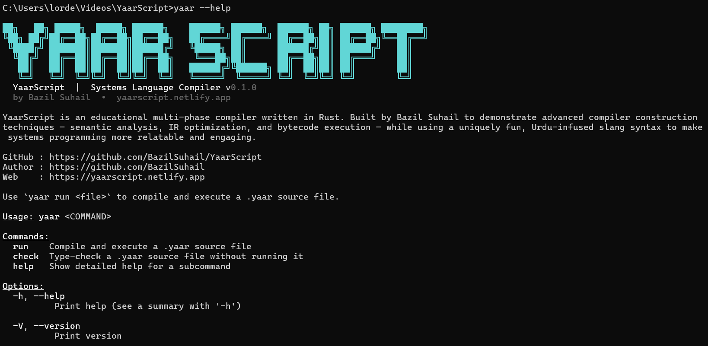

<div align="center">
  
</div>

<div align="center">

[](https://yaarscript.netlify.app/)
[](https://rustup.rs/)
[](#)
[](#)
[](https://github.com/BazilSuhail/YaarScript/releases)
[](http://makeapullrequest.com)
[](https://www.rust-lang.org/)
[](https://github.com/BazilSuhail/YaarScript/blob/main/LICENSE)

 </div>

#### YaarScript: an Urdu-Slang Multi-phase Compiler

> **YaarScript** is an educational multi-phase compiler written in Rust by [Bazil Suhail](https://github.com/BazilSuhail). It was built to demonstrate advanced compiler construction techniques — semantic analysis, IR optimization, bytecode execution — with a uniquely fun, Urdu-infused slang syntax that makes systems programming more relatable and engaging.

> [!TIP]
> **Quick Links:**
> * **GitHub Repo:** [github.com/BazilSuhail/YaarScript](https://github.com/BazilSuhail/YaarScript)
> * **Official Website:** [yaarscript.netlify.app](https://yaarscript.netlify.app)
> * **Online Playground:** [Try YaarScript in the Browser](https://yaarscript.netlify.app/editor)
> * **Documentation:** [Read the Docs](https://yaarscript.netlify.app/docs)
> * **Author Portfolio:** [bazilsuhail.netlify.app](http://bazilsuhail.netlify.app)

---

## Installation (Windows)

### Prerequisites

- [Rust toolchain](https://www.rust-lang.org/tools/install) (Rust 2024 Edition or later)
- Windows 10 / Windows 11

### Option 1 — Install from Source

```powershell
# Clone the repository
git clone https://github.com/BazilSuhail/YaarScript.git
cd yaarscript

# Build the compiler binary
cargo build --release

# (Optional) Add to PATH so `yaar` is available globally
# Add this line to your PowerShell $PROFILE:
#   $env:Path += ";C:\path\to\yaarscript\target\release"
```

### Option 2 — Download Pre-built Binary

Download the latest `yaar.exe` from the [Releases](https://github.com/BazilSuhail/YaarScript/releases) page and place it in a directory on your `PATH`.

---

## CLI Overview

YaarScript ships with a command-line interface built with **clap**, **colored**, and **indicatif** for a polished terminal experience.

<div align="center">
  
</div>

```
yaar <COMMAND> [options] <file>
```

### Commands

| Command | Description |
|---------|-------------|
| `yaar run <file>` | Compile and execute a `.yaar` source file |
| `yaar check <file>` | Type-check only (stops before codegen) |
| `yaar help [command]` | Show detailed help and examples |
| `yaar --help` | Show general help |
| `yaar --version` | Show version |

### `yaar run`

Compiles a `.yaar` file through all pipeline stages and executes the optimized IR.

```powershell
yaar run hello.yaar
yaar run myprogram          # auto-resolves to myprogram.yaar
yaar run test.yaar --no-exec    # compile only, skip execution
```

**Flags:**

| Flag | Description |
|------|-------------|
| `--allow-txt` | Allow `.txt` files as input (default: rejected) |
| `--no-exec` | Compile only, do not execute |

### `yaar check`

Runs lexing, parsing, scope analysis, and type checking without executing.

```powershell
yaar check types.yaar
```

### `yaar help`

```powershell
yaar help          # list all commands
yaar help run      # detailed help for the run command
yaar help check    # detailed help for the check command
```

---

## Language Features

| Feature | Description |
|---------|-------------|
| **Urdu-Slang Keywords** | `yaar` (main), `faisla` (bool), `bolo` (print), `agar`/`warna` (if/else), `jabtak` (while), `dohrao` (for), `intekhab` (switch), and more |
| **Power Operator** | Native `**` operator with Precedence 9 |
| **System Intrinsics** | `suno()` (stdin), `waqt()` (timestamp), `ittifaq(min,max)` (random) |
| **Zero-Coercion Type System** | Strict type checking — no implicit conversions |
| **Fixed-Point IR Optimizer** | Constant folding, value propagation, dead code elimination |
| **Direct TAC Execution** | Compiles to flat Three-Address Code and executes in-memory |

### Urdu Slang Keywords

| YaarScript | C-Equivalent | Purpose |
|------------|--------------|---------|
| `number` | `int64_t` | 64-bit signed integer |
| `float` | `double` | 64-bit floating point |
| `faisla` | `bool` | Boolean value |
| `lafz` | `char*` | String primitive |
| `khaali` | `void` | No return value |
| `pakka` | `const` | Immutable constant |
| `yaar` | `main` | Entry point block |
| `agar` | `if` | Conditional branch |
| `warna` | `else` | Alternative branch |
| `jabtak` | `while` | Loop continuation |
| `dohrao` | `for` | Iterative loop |
| `intekhab` | `switch` | Multi-way branching |
| `bas_kar` | `break` | Scope exit |
| `wapsi` | `return` | Function return |
| `qism` | `enum` | Enumeration type |
| `bolo` | `printf` | Console output |
| `suno` | `scanf` | Console input |
| `sahi` | `true` | Boolean true |
| `galat` | `false` | Boolean false |

---

## Code Examples

### Valid Program (`tests/type/valid.yaar`)

```rust
yaar {
    number w = 10;
    number h = 20;

    dohrao (number i = 0; i < 5; i++) {
        agar (i == 3) {
            bas_kar;
        }
    }

    faisla flag = (w > 5) && (h < 50);
    faisla check = !flag;

    number result = w ** 2;
    bolo("Computed successfully! ", result);
}
```

**Output:**
```
0
1
2
Computed successfully! 100
```

### Type Error Detection (`tests/type/error.yaar`)

```rust
khaali invalidVar;

khaali voidFunc() {
    bolo("hello");
}

yaar {
    number i = 10;
    float f = 3.14;
    voidFunc(f);
    i = 3.14;
    agar (i) {
        bolo("wont work");
    }
}
```

**Compiler Output:**
```
[Type Error] Variable invalidVar cannot be of type void
[Type Error] Function 'voidFunc' expects 0 arguments, but got 1
[Type Error] Invalid assignment: Cannot assign type 'float' to variable 'i' of type 'int'
[Type Error] Condition must be a boolean expression
```

---

## Project Structure

```
src/
├── lexer/           # Lexical analysis (maximal-munch scanner)
├── parser/          # Recursive descent + Pratt parsing
├── core/            # AST nodes and token enums
├── semantics/       # Scope analyzer + type checker
├── ir_pipeline/     # TAC generation + fixed-point optimizer
├── codegen/         # Execution engine runtime
├── error.rs         # Centralized error reporting
├── lib.rs           # Module exports
└── main.rs          # CLI entry point
```

## Building

```powershell
cargo build --release      # optimized binary
cargo build                # debug build
```

## Running

```powershell
yaar run test_input.yaar           # compile & execute
yaar run test_input --no-exec       # compile only
yaar check test_input.yaar          # type-check only
```

## Running Test Suites

```powershell
cargo run -- tests/type/valid.yaar
cargo run -- tests/type/error.yaar
```
