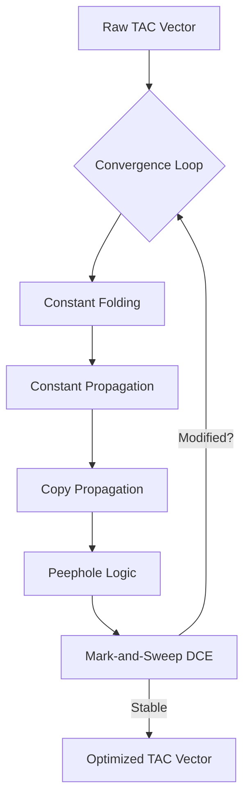

# 🚀 Optimization Engine Specification (IR Middle-End)

> [!NOTE]
> The **IR Optimizer** is a sophisticated, multi-pass engine designed to transform raw **Three-Address Code (TAC)** into a streamlined, high-performance intermediate representation. By analyzing data flow and instruction patterns, it reduces total execution cycles and register pressure at compile-time.

---

## 🏗️ Architecture: The Fixed-Point Convergence Model

The optimizer is built as an iterative loop that repeatedly applies multiple analysis and transformation passes until the intermediate representation reaches a stable state ($\Delta = 0$).



### The Optimization Strategy
- **Iterative fixed-point**: Since one pass (like constant propagation) can unlock another (like constant folding), the optimizer runs up to **10 iterations** or until no further changes are detected.
- **Cascading Effects**: Folding `2 + 2` into `4` might make a variable constant, enabling its value to be propagated further downstream.

---

## 🔬 Optimization Passes & Technical Analysis

### 1. Multi-Type Constant Folding
**Logic**: Performs compile-time evaluation of binary and unary expressions where all operands are Literals.
- **Power folding (`**`)**: Evaluates `i64::pow` and `f64::powf` during compilation.
- **Example**: `t0 = 2 ** 10` $\rightarrow$ `t0 = 1024`.

### 2. Constant & Copy Propagation
**Logic**: Replaces variables known to have a literal value with that literal.
- **Boundary Handling**: Tracking maps are cleared at `Label` and `FuncStart` to ensure optimistic assumptions never cross complex control-flow boundaries or function entries.

### 3. Algebraic Peephole Optimization
**Logic**: Sliding-window analysis for local mathematical identities.
- $x + 0 \equiv x$
- $x - 0 \equiv x$
- $x \times 1 \equiv x$
- $x \times 0 \equiv 0$
- $x / 1 \equiv x$

### 4. Mark-and-Sweep Dead Code Elimination (DCE)
**Logic**: Identifies and prunes any instruction whose output is not consumed by the program.
- **Mark Phase**: Scans all instructions to collect all used `Operand::Var` and `Operand::Temp` as sources.
- **Sweep Phase**: Prunes any assignment whose destination is not in the "used" set.
- **Intrinsic Sensitivity**: `Print`, `READ`, `TIME`, and `RANDOM` are marked as **Always Used** to ensure their side-effects are preserved.

---

## 🔥 Examples & Technical Analysis

### Scenario: The Cascading Constant Loop
**Source Code:**
```rust
number a = 10;
number b = a + 5;
number c = b * 2;
bolo(c);
```

**Step-by-Step Optimization trace:**
1.  **Propagation**: `a` is replaced by `10` in `t0 = a + 5`.
2.  **Folding**: `10 + 5` is folded into `15`.
3.  **Propagation**: `b` is replaced by `15` in `t1 = b * 2`.
4.  **Folding**: `15 * 2` is folded into `30`.
5.  **DCE**: Assignments to `a` and `b` are removed as their values are now fully resolved.
6.  **Result**: `bolo(30);`

> [!TIP]
> The optimizer implements a division-by-zero safeguard during the `constant_folding` pass to prevent compiler crashes on malicious or buggy source code.

---

## 🛠️ Performance & Complexity Specification

| Pass | Logic Complexity | Purpose |
| :--- | :--- | :--- |
| **Folding** | $O(N)$ | Literal reduction |
| **Propagation** | $O(N)$ | Identifier-to-Literal mapping |
| **DCE** | $O(N \times I)$ | Dependency-based pruning |

> [!IMPORTANT]
> The convergence loop ensures that even deeply nested constant chains are resolved into immediate values before the execution phase begins.

---

## 🚨 Implementation Detail: DCE Fixed-Point
The `dead_code_elimination_pass` itself can sometimes be run internally in a loop. Pruning one variable (like `c`) might make its source variable (`b`) dead as well.

```rust
// DCE Sweep implementation snippet
fn dead_code_elimination_pass(&mut self) -> bool {
    let used_vars = self.collect_used_vars();
    let old_count = self.instructions.len();
    self.instructions.retain(|instr| {
        match instr {
            Instruction::Assign(dest, _) | Instruction::Binary(dest, _, _, _) => {
                used_vars.contains(dest) || self.is_intrinsic_target(dest)
            }
            _ => true, // Keep side-effects
        }
    });
    self.instructions.len() != old_count
}
```

> [!CAUTION]
> If the `MAX_ITERATIONS` limit is reached without convergence, the compiler will exit with the current state of IR. While rare, this prevents infinite optimization loops in complex cyclic TAC.

---

## 💻 Test Case Integrations

### ✅ Full Iterative Pass Example (based on `valid.yaar` expressions)
The Fixed-Point engine handles nested deterministic math, resolving operations automatically.
```rust
number w = 10;
number sum = 10 + w;
number double = sum * 2;
bolo(double);
```
**Pre-Optimization TAC (Raw Generation):**
```nginx
number w = 10
t0 = 10 Plus w
number sum = t0
t1 = sum Multiply 2
number double = t1
Print double
```

**Post-Optimization TAC (Convergence = Reached):**
```nginx
Print 40
```
> ***Optimizer Note***: *Pass 1 folded constants, Pass 2 propagated `w` as `10`, followed by further folding. Because the variables themselves were not invoked after printing, the Dead Code Elimination pass scrubbed the unneeded assignments.*
