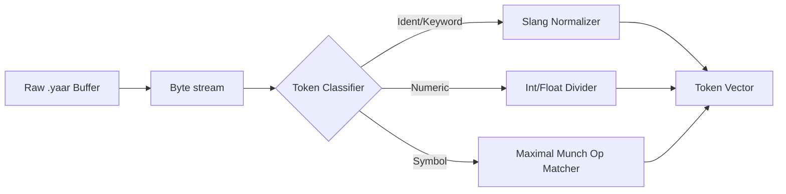

# 🔤 Lexical Analysis Specification (The Lexer)

> [!NOTE]
> The **Lexer** serves as the primary lexical scanner of the YaarScript pipeline. It performs a linear transformation of raw UTF-8 source text into a prioritized stream of **Tokens**, fundamentally lowering the input into categories consumable by the Syntax Parser.

---

## 🏗️ Architecture & Flux

The Lexer utilizes a **Greedy Maximal-Munch Algorithm** to identify the longest possible lexeme matches. This ensures that operators like `**` are correctly identified as a single `Power` token rather than two consecutive `Multiply` tokens.



### Core Lexical Responsibilities
- **Unicode Support**: Variables and identifiers allow for non-ASCII characters, whereas keywords remain pinned to the Urdu-slang specification.
- **Position Tracking**: Each token is stamped with a precise `(Line, Column)` metadata pair, enabling Pinpoint Error Reporting in the Middle-End.
- **Urdu Normalization**: During tokenization, literal slang values like `sahi` (True) and `galat` (False) are normalized to their canonical boolean representations within the token's value field.

---

## 🛠️ Token Specification

### 1. Slang Keyword Normalization Table
YaarScript maps localized Urdu slang to internal compiler primitives.

| YaarScript | Purpose | Internal Primitive |
| :--- | :--- | :--- |
| `number` | i64 Typed Storage | `TokenType::Int` |
| `faisla` | Binary Logic Type | `TokenType::Bool` |
| `yaar` | Entry Point Block | `TokenType::Main` |
| `agar` | Conditional Dispatch | `TokenType::If` |
| `jabtak` | Loop Continuation | `TokenType::While` |
| `bas_kar` | Control-Flow Exit | `TokenType::Break` |
| `wapsi` | Return Expression | `TokenType::Return` |

> [!TIP]
> The Lexer uses a `HashMap<String, TokenType>` for $O(1)$ keyword lookups once an identifier has been fully scanned.

### 2. The Power Operator (`**`) Detection
The Lexer differentiates between multiplication and exponentiation through a two-character lookahead:
```rust
// Lexer Logic
if self.peek() == Some('*') {
    self.advance(); // Consume the second '*'
    return Some(Token::new(TokenType::Power, "**", line, col));
}
```

---

## 🔥 Examples & Technical Analysis

### Scenario: `agar (result > 5)`
1. **`agar`**: Scanned as an identifier. Consulting the Slang Map reveals it corresponds to `TokenType::If`.
2. **`(`**: Recognized as a delimiter `TokenType::LeftParen`.
3. **`result > 5`**: Scanned as `TokenType::Identifier`, `TokenType::Greater`, and `TokenType::IntLiteral`.

> [!IMPORTANT]
> **Greedy Matching** is critical for operator sequences. `++`, `--`, `==`, `!=`, and `**` are all handled through immediate peek-and-advance logic to ensure correctness in the expression tree.

---

## 🚨 Lexical Error Categorization
Any character sequence that does not map to a known grammar branch triggers a `TokenType::Error`.

```rust
number $cost = 100; // ERROR: Unexpected character '$' at [1:8]
```

> [!CAUTION]
> A lexical error represents a critical failure in the front-end. The Lexer will complete the scan to identify all possible illegal characters but will flag the session as un-parsable.

---

## 💻 Test Case Integrations

### ✅ Valid Lexical Tokenization (from `tests/type/valid.yaar`)
```rust
dohrao (number i = 0; i < 5; i++) {
    agar (i == 3) {
        bas_kar; 
    }
}
```
**Expected Lexer Output (Abbreviated):**
```text
Token(T_FOR, "dohrao")
Token(T_LPAREN, "(")
Token(T_INT, "number")
Token(Ident, "i")
Token(T_ASSIGNOP, "=")
Token(IntLit, "0")
...
Token(T_BREAK, "bas_kar")
```

### ❌ Invalid Lexical Sequence (Hypothetical Error)
While `tests/type/error.yaar` primarily targets semantic errors, an invalid character halts lexical scanning immediately:
```rust
number @invalid = 10;
```
**Expected Output:**
```text
[Lexer Error] Unexpected character '@' at line 1, column 8
```
