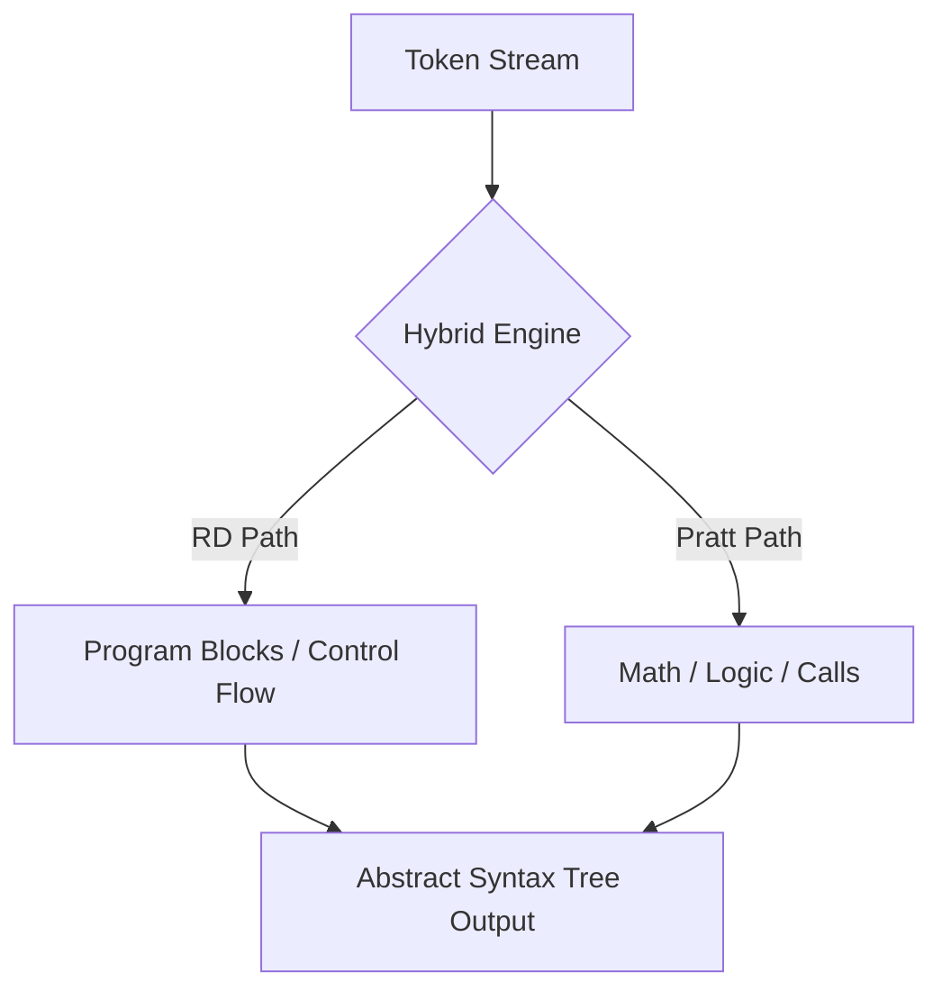

# 🌳 Syntax Analysis Specification (The Parser)

> [!NOTE]
> The **Parser** is the core of the YaarScript compiler front-end. It consumes the tokenized stream from the Lexer and constructs an **Abstract Syntax Tree (AST)** by employing a sophisticated **Hybrid Parsing Model**.

---

## 🏗️ Architecture: The Hybrid Model

Our parser combines the strengths of two established algorithms to handle different language structures with maximum performance and readability:

### 1. High-Level Recursive Descent
- **Usage**: Handles top-down structural elements like program-level declarations, function definitions (`FunctionDecl`), and control-oriented blocks (`agar`, `jabtak`, `dohrao`).
- **Mechanism**: Seeing a keyword immediately triggers the corresponding `parse_X_statement` method.
- **Why?**: Recursive Descent (RD) excels at parsing structured, non-ambiguous blocks where the next token determines the entire logic branch.

### 2. Expression Parsing via Pratt Algorithm
- **Usage**: Handles all arithmetic, logical, and relational expressions (`BinaryExpr`, `UnaryExpr`, `CallExpr`).
- **Mechanism**: Utilizes **Binding Power** (Nud/Led dispatch) instead of a fixed function-per-level hierarchy.
- **Why?**: Pratt parsing solves the "Infinite Recursion" and "Hardcoded Precedence" issues of pure RD by using a top-down operator precedence lookahead.



---

## 📊 Precedence & Operator Specification

The YaarScript expression engine implements a 12-level precedence hierarchy. The **Power Operator (`**`)** is a first-class citizen, sitting at level 9 to ensure correct mathematical evaluation.

| Level | Description | Operators | Associativity |
| :--- | :--- | :--- | :--- |
| **1** | Assignment | `=` | Right-to-Left |
| **2** | Logical OR | `||` | Left-to-Right |
| **3** | Logical AND | `&&` | Left-to-Right |
| **4** | Equality | `==`, `!=` | Left-to-Right |
| **5** | Relational | `<`, `>`, `<=`, `>=` | Left-to-Right |
| **7** | Additive | `+`, `-` | Left-to-Right |
| **8** | Multiplicative | `*`, `/`, `%` | Left-to-Right |
| **9** | **Exponentiation** | **`**`** | **Left-to-Right** |
| **12** | Function Call | `()` | Highest |

> [!IMPORTANT]
> Because the Power operator holds **Level 9** precedence, the expression `5 + 2 * 3 ** 2` is parsed as `5 + (2 * (3 ** 2)) = 23`.

---

## 🔥 AST Examples & Technical Analysis

### Scenario: `number value = 10 + 2 ** 8;`

The Pratt engine processes the additive expression `10 + ...` but then sees `2 ** 8`. Since `**` (9) has higher binding power than `+` (7), the power operation is nested deeper in the tree.

**AST Visualization:**
```text
VarDecl(number, "value")
  ├─ InitExpr
      └─ BinaryExpr(+)
          ├─ IntLiteral(10)
          └─ BinaryExpr(**)
              ├─ IntLiteral(2)
              └─ IntLiteral(8)
```

---

## 🛠️ Grammar Specification (EBNF)

```ebnf
Program          ::= Declaration* MainDecl?
Declaration      ::= VarDecl | FunctionProto | FunctionDecl | EnumDecl
VarDecl          ::= ("pakka" | "global")? Type Identifier ("=" Expression)? ";"
MainDecl         ::= "yaar" "{" Statement* "}"

Statement        ::= IfStmt | WhileStmt | ForStmt | SwitchStmt | ReturnStmt | BreakStmt | Block | ExpressionStmt
IfStmt           ::= "agar" "(" Expression ")" Block ("warna" Block)?
DoWhileStmt      ::= "karo" Block "jabtak" "(" Expression ")" ";"
```

> [!TIP]
> Each node in our AST implements `Clone` and `Debug` for easy multi-pass semantic traversal and visualization through the `ast_printer` module.

---

## 🚨 Syntax Error Handling
If the parser meets a token that violates the EBNF grammar, it throws a `ParseError` with strict categorization:

- **UnexpectedToken**: Found `+` when expecting an Identifier.
- **UnclosedBlock**: Found `EOF` while still inside a `{ ... }` scope.
- **MissingSemicolon**: Found a new declaration without terminating the previous assignment.

> [!CAUTION]
> Our front-end stops at the first encountered Parse Error to prevent Cascading Junk Errors from overwhelming the user output.

---

## 💻 Test Case Integrations

### ✅ Valid AST Generation (from `tests/type/valid.yaar`)
```rust
number calculateArea(number width, number height) {
    number area = width * height;
    wapsi area;
}
```
**Expected Parser Output (AST Hierarchy):**
```text
FunctionDecl(number, "calculateArea")
  Param(number, "width")
  Param(number, "height")
  Block
    VarDecl(number, "area")
      BinaryExpr(*)
        Identifier("width")
        Identifier("height")
    ReturnStmt
      Identifier("area")
```

### ❌ Syntax Error Halting Example
An unclosed boundary prevents the AST from executing further compilation steps:
```rust
yaar {
    number i = 0;
// EOF before }
```
**Expected Output:**
```text
[Parse Error] UnclosedBlock: Expected '}', found EOF
```