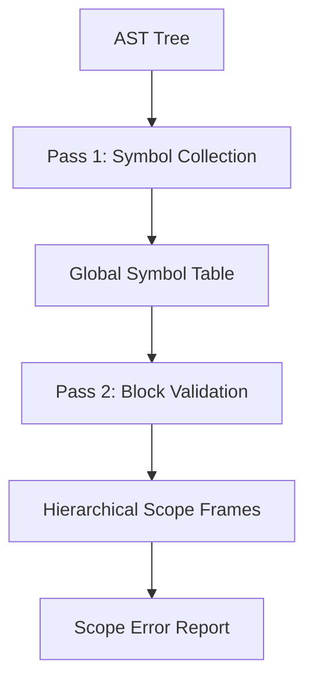

# 🎯 Semantic Analysis Specification (The Scope Analyzer)

> [!NOTE]
> The **Scope Analyzer** is the first semantic layer of the middle-end. It enforces lexical scoping rules, identifies symbol overlapping, and constructs a hierarchical **Symbol Table** (ScopeFrame tree) for use by the Type Checker and Tac Generator.

---

## 🏗️ Architecture: Two-Pass Analysis

To handle **Forward References** (where a function calls another function defined later in the source), the analyzer performs two distinct passes:

### Pass 1: Global Declaration Collection
The analyzer scans all top-level `FunctionDecl`, `FunctionProto`, and `EnumDecl`.
- **Why?**: This allows the analyzer to know about all function signatures before it begins checking the function bodies, effectively resolving the "Recursive Call" and "Mutual Recursion" problems.

### Pass 2: Validation & Scope Traversal
The analyzer traverses the AST using a **Deep-Search Strategy**:
1. It pushes a new `ScopeFrame` onto the stack whenever entering a `{ ... }` block.
2. It validates every `Identifier` by searching the scope stack from **Inner to Outer**.
3. It pops the `ScopeFrame` upon exit.



---

## 🛠️ Symbol Table Meta-Data

Each symbol is represented by the `SymbolInfo` struct, containing critical metadata for the downstream middle-end:

| Field | Description |
| :--- | :--- |
| `name` | Canonical identifier name. |
| `line / col` | Traceability for error flagging. |
| `is_function` | Flags usage of `()` as mandatory. |
| `is_enum_value` | Flags the identifier as a constant literal. |
| `is_prototype` | Indicates a signature with no body yet (proto). |
| `params` | Vector of `(TypeNode, String)` for signature verification. |

---

## 🔥 Scope Constraints & Rules

### 1. The Shadowing Rule
Within a single file, an inner block can declare a variable with the same name as an outer block. This is authorized **Shadowing**.
```rust
number value = 10;
agar (sahi) {
    number value = 20; // AUTHORIZED: Value is 20 in this block.
    bolo(value);
}
// value is 10 here.
```

### 2. The Storage Class (Global vs Local)
- **`qism` (Enums)**: Must be declared at the Global scope. Declaring an enum inside `yaar` or another function results in `InvalidStorageClassUsage`.
- **`global`**: Declares a symbol to be shared across all function scopes.

> [!IMPORTANT]
> Variables declared inside the `yaar` block are technically **local to the entry point** and are not accessible by other functions unless passed as parameters.

---

## 🚨 Error Categorization

YaarScript's Scope Analyzer identifies 11 distinct error types:

1.  **UndeclaredVariableAccessed**: Found an identifier with no entry in the entire scope stack.
2.  **VariableRedefinition**: Multiple variables with the same name in the **same** block.
3.  **ConflictingFunctionDefinition**: Function body signature differs from its prototype.
4.  **InvalidForwardReference**: Using a local variable before its declaration line (unlike global functions, local variables do not support forward references).

> [!WARNING]
> Function parameters and local variables cannot share the same name within the same function scope. This triggers a `ParameterRedefinition` error.

---

## 🛠️ Implementation Specs

### The Scope Stack (LIFO)
During analysis, the `ScopeAnalyzer` maintains a `Vec<ScopeFrame>`.
```rust
// Symbol Lookup Logic
pub fn lookup_symbol(&self, name: &str) -> Option<&SymbolInfo> {
    for frame in self.current_scope_stack.iter().rev() {
        if let Some(info) = frame.symbols.get(name) {
            return Some(info);
        }
    }
    None
}
```

> [!CAUTION]
> If Pass 2 encounters a `SymbolNotFoundError`, the compiler halts. This prevents the Type Checker from attempting to infer types for undefined variables.
