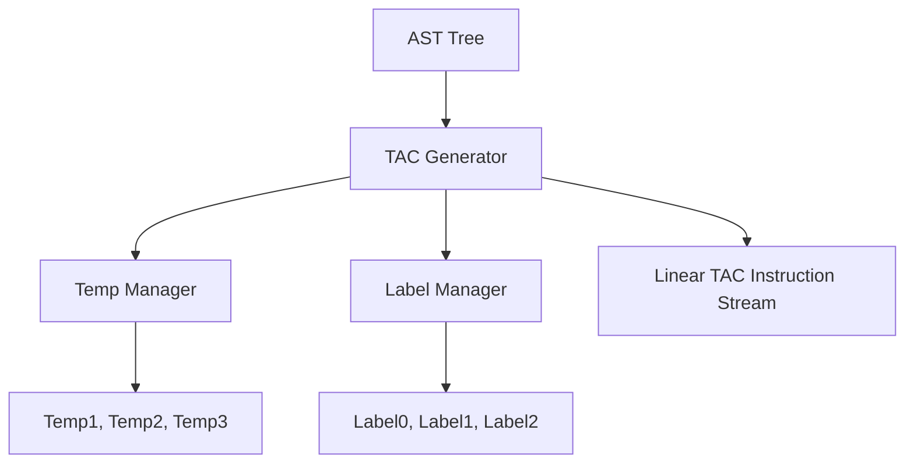

# ⚙️ Intermediate Representation Specification (TAC Generation)

> [!NOTE]
> The **TAC Generator** is the first phase of the YaarScript compiler's backend logic. It converts the validated Abstract Syntax Tree (AST) into a flat, linear **Three-Address Code (TAC)**. This lower-level IR is platform-independent and serves as the primary canvas for optimization.

---

## 🏗️ Architecture: Standard Quadruple-like Form

YaarScript TAC adopts a **Standard Quadruple Form**, where each instruction involves at most three operands (typically two sources and one destination destination). This structure is ideal for data-flow analysis and register allocation.



### Core IR Responsibilities
- **Flattening**: Transforming nested expression trees (`a + b * c`) into a sequence of binary instructions.
- **Label Generation**: Resolving complex control flow (`if-else`, `while`, `for`) into symbolic `Goto` and `IfFalse` instructions.
- **Intrinsic Translation**: Mapping high-level syntax like `suno`, `waqt`, and `ittifaq` to specialized, protected IR instructions.

---

## 🛠️ IR Instruction Set & Operands

### 1. Operand Specification
YaarScript uses four distinct types of operands in its TAC:

| Operand | Purpose | Internal Representation |
| :--- | :--- | :--- |
| **Temp** | Virtual registers for intermediate results. | `Operand::Temp(usize)` |
| **Var** | Named variable storage from source code. | `Operand::Var(String)` |
| **Literals** | Canonical value representation. | `Operand::Int(i64)`, `Operand::Float(f64)` |
| **Label** | Symbolic jump targets for control flow. | `Operand::Label(String)` |

### 2. The Instruction Set (Partial List)
| Instruction | Operation | Side-Effects |
| :--- | :--- | :--- |
| **`Binary`** | `dest = l OP r` | None |
| **`Unary`** | `dest = OP src` | None |
| **`Assign`** | `dest = src` | Mutation |
| **`Read`** | `dest = Suno()` | **Volatile (I/O)** |
| **`Time`** | `dest = Waqt()` | **Volatile (System)** |
| **`Random`** | `dest = Ittifaq(l, r)` | **Volatile (Entropy)** |
| **`Print`** | `Print(src)` | **Volatile (Stdout)** |

> [!IMPORTANT]
> **Intrinsic Protecting**: Intrinsics like `READ`, `TIME`, and `RANDOM` are generated as specialized instructions rather than standard `Call` instructions. This prevents the Optimizer from inadvertently pruning them as "Side-Effect Free" code.

---

## 🔥 Examples & Technical Analysis

### Scenario: Flattening `number x = 2 * (3 + 1);`
The generator recursively traverses the tree, emitting independent binary instructions for each node:
```nginx
t0 = 3 Plus 1
t1 = 2 Multiply t0
number x = t1  ; Copy to result variable
```

### Scenario: The Power Operator (`**`)
Because exponentiation is a first-class citizen at **Precedence Level 9**, the generator emits a specialized `Power` binary instruction:
```nginx
t0 = 2 Power 10
number result = t0
```

> [!TIP]
> The TAC generator uses a LIFO `break_stack` and `label_counter` to handle nested loops and `bas_kar` (break) logic without manual label management.

---

## 🚨 Control Flow Lowering

### Example: Nested `agar-warna` (If-Else)
```rust
agar (x > 0) { ... } warna { ... }
```
**Generated TAC Logic:**
1.  **`t0 = x Gt 0`**: Evaluate condition.
2.  **`ifFalse t0 goto L0`**: If false, jump to the `warna` block.
3.  **`...`**: Execute `agar` block.
4.  **`goto L1`**: Unconditionally jump over the `warna` block.
5.  **`L0:`**: Target for the `warna` block.
6.  **`...`**: Execute `warna` block.
7.  **`L1:`**: Common exit point.

> [!CAUTION]
> If a jump target (Label) is not emitted during the generation phase, the execution engine will crash. The generator ensures that every `goto` points to a strictly defined `Label`.

---

## 💻 Test Case Integrations

### ✅ Instruction Generation (from `tests/type/valid.yaar`)
```rust
faisla flag = (w > 5) && (area < 500);
```
**Expected TAC Generation Iteration:**
```nginx
t0 = w Gt 5
t1 = area Lt 500
t2 = t0 And t1
faisla flag = t2
```

### ✅ Flow Lowering Logic (from `tests/type/valid.yaar`)
```rust
dohrao (number i = 0; i < 5; i++) {
    agar (i == 3) { bas_kar; }
}
```
**Expected Lowered Result (Loop & Break handling):**
```nginx
number i = 0
L_START:
t0 = i Lt 5
ifFalse t0 goto L_END
t1 = i EqualOp 3
ifFalse t1 goto L_SKIP
goto L_END   ; From bas_kar;
L_SKIP:
i = i Plus 1
goto L_START
L_END:
```