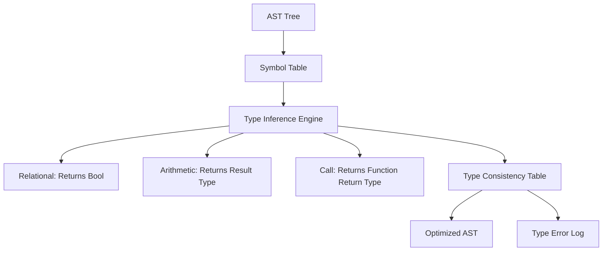

# ⚖️ Semantic Analysis Specification (The Type Checker)

> [!NOTE]
> The **Type Checker** is the second semantic analysis pass of the YaarScript compiler middle-end. It enforces the **Strict No-Implicit-Conversion Policy**, ensuring that all operations, assignments, and function calls are performed with binary-compatible types.

---

## 🏗️ Architecture: The Type Inference Engine

Our type checker takes the AST and a reference to the **Symbol Table** (ScopeFrame tree) from the Scope Analyzer. It navigates the AST and performs **bottom-up type inference**.



### 1. Strict Typing Principles
YaarScript follows a **Zero-Coercion Policy**:
- **`number` + `float`**: **REJECTED**. You must use explicit casting (if supported) or use matching types.
- **`agar (number)`**: **REJECTED**. The condition for an `if` block must be a `faisla` (bool).
- **`number x = 'c'`**: **REJECTED**. Characters cannot be assigned to integers without an explicit conversion block.

> [!IMPORTANT]
> This strict approach prevents high-level "magic" from obscuring low-level logic, making YaarScript an ideal platform for educational systems programming.

---

## 🛠️ Type Verification Specifications

The Checker implements 17 distinct verification points:

| Verification Point | Success Condition |
| :--- | :--- |
| **Assignment** | `typeof(LHS) == typeof(RHS)` |
| **Arithmetic** | Both operands are `number` OR both are `float`. |
| **Logic (`&&`, `||`)** | Both operands are `faisla`. |
| **Relational (`>`, `<`)** | Both operands are matching numeric types. |
| **Function Return** | `ExpressionType == current_fn.return_type`. |
| **Control Flow** | `ConditionType == faisla`. |

### Context-Sensitive Analysis
The checker maintains a context stack for tracking:
- **`current_fn_return_type`**: Validates whether a `wapsi` statement actually returns the correct type.
- **`loop_depth`**: Ensures `bas_kar` (break) is only used inside a loop or switch.
- **`switch_depth`**: Ensures `agar_ho` (case) labels are only used within a switch scope.

---

## 🔥 Examples & Technical Analysis

### Scenario: `number x = 10 + 3.14;`
1.  **`10`**: Inferred as `number`.
2.  **`3.14`**: Inferred as `float`.
3.  **`+`**: The Additive binary check fails because `number` and `float` are not identical types.
4. **Trigger**: `TypeErrorType::ExpressionTypeMismatch`.

> [!TIP]
> Each `FunctionDecl` must have a return statement that matches its return type. If a non-void function completes its body without a `wapsi`, the checker logs a `MissingReturnStatement` error.

---

## 🚨 Detailed Error Categorization

1.  **ErroneousVarDecl**: Declaring a variable of type `khaali` (void). Variables must have a storage size.
2.  **FnCallParamType**: Passing an argument that differs in type from the function prototype.
3.  **ReturnStmtInVoid**: Using `wapsi (expr)` in a function declared as `khaali`.
4.  **NotOnNonBool**: Using `!` on a `number`. The logical negation operator is strictly for `faisla`.

> [!CAUTION]
> If the Type Checker logs even a single error, the compilation sequence is aborted. No Three-Address Code (TAC) will be generated for a program that fails type consistency.

---

## 🛠️ Implementation Strategy

### In-Sync Scope Syncing
The Type Checker maintains a `scope_child_indices` stack. Since the AST traversal during type checking follows the exact same path as the Scope Analyzer's Pass 2, the checker can navigate the `ScopeFrame` tree in perfect sync, ensuring $O(1)$ symbol lookups.
```rust
// Type Inference Implementation
fn infer(&mut self, node: &ASTNode) -> TypeNode {
    match node {
        ASTNode::IntLiteral(_) => TypeNode::Builtin(TokenType::Int),
        ASTNode::BinaryExpr(b) => {
            let lt = self.infer(&b.left);
            let rt = self.infer(&b.right);
            // Validation logic...
        }
        // ...
    }
}
```